# 🆓 Free Crypto News API

<p align="center">
  <a href="https://github.com/nirholas/free-crypto-news/stargazers"></a>
  <a href="https://github.com/nirholas/free-crypto-news/blob/main/LICENSE"></a>
  <a href="https://github.com/nirholas/free-crypto-news/actions/workflows/ci.yml"></a>
  <a href="https://github.com/nirholas/free-crypto-news/issues"></a>
  <a href="https://github.com/nirholas/free-crypto-news/pulls"></a>
</p>

<p align="center">
  
</p>

> ⭐ **If you find this useful, please star the repo!** It helps others discover this project and motivates continued development.

---

🚨 **January 19, 2026 UPDATE:** All free resources from Vercel have been used. I will need to consider rate limiting, a freemium API, or find sponsorship to pay for the upkeep. I do not mind paying here and there but unfortunately it will cut off the ability for me to develop. I apologize if you were using the API and it went down, you may host your own on Vercel, Railway, locally, and numerous other ways as well. If you need assistance deploying this repo, please let me know and I will be glad to assist you. Will update the README when I get the API going again 🚨

---

Get real-time crypto news from 7 major sources with one API call.

> 🌍 **Available in 18 languages:** [中文](locales/README/index.zh-CN.md) | [日本語](locales/README/index.ja-JP.md) | [한국어](locales/README/index.ko-KR.md) | [Español](locales/README/index.es-ES.md) | [Français](locales/README/index.fr-FR.md) | [Deutsch](locales/README/index.de-DE.md) | [Português](locales/README/index.pt-BR.md) | [Русский](locales/README/index.ru-RU.md) | [العربية](locales/README/index.ar.md) | [More...](locales/)

```bash
curl https://free-crypto-news.vercel.app/api/news
```

That's it. It just works.

---


| | Free Crypto News | CryptoPanic | Others |
|---|---|---|---|
| **Price** | 🆓 Free forever | $29-299/mo | Paid |
| **API Key** | ❌ None needed | Required | Required |
| **Rate Limit** | Unlimited* | 100-1000/day | Limited |
| **Sources** | 7 | 1 | Varies |
| **Self-host** | ✅ One click | No | No |
| **PWA** | ✅ Installable | No | No |
| **MCP** | ✅ Claude + ChatGPT | No | No |

---

## 📱 Progressive Web App (PWA)

Free Crypto News is a **fully installable PWA** that works offline!

### Features

| Feature | Description |
|---------|-------------|
| 📲 **Installable** | Add to home screen on any device |
| 📴 **Offline Mode** | Read cached news without internet |
| 🔔 **Push Notifications** | Get breaking news alerts |
| ⚡ **Lightning Fast** | Aggressive caching strategies |
| 🔄 **Background Sync** | Auto-updates when back online |
| 🎯 **App Shortcuts** | Quick access to Latest, Breaking, Bitcoin |
| 📤 **Share Target** | Share links directly to the app |

### Install the App

**Desktop (Chrome/Edge):**
1. Visit [free-crypto-news.vercel.app](https://free-crypto-news.vercel.app)
2. Click the install icon (⊕) in the address bar
3. Click "Install"

**iOS Safari:**
1. Visit the site in Safari
2. Tap Share (📤) → "Add to Home Screen"

**Android Chrome:**
1. Visit the site
2. Tap the install banner or Menu → "Install app"

### Service Worker Caching

The PWA uses smart caching strategies:

| Content | Strategy | Cache Duration |
|---------|----------|----------------|
| API responses | Network-first | 5 minutes |
| Static assets | Cache-first | 7 days |
| Images | Cache-first | 30 days |
| Navigation | Network-first + offline fallback | 24 hours |

### Generate PNG Icons

SVG icons work in modern browsers. For legacy support:

```bash
npm install sharp
npm run pwa:icons
```

---

## Sources

We aggregate from **7 trusted outlets**:

- 🟠 **CoinDesk** — General crypto news
- 🔵 **The Block** — Institutional & research
- 🟢 **Decrypt** — Web3 & culture
- 🟡 **CoinTelegraph** — Global crypto news
- 🟤 **Bitcoin Magazine** — Bitcoin maximalist
- 🟣 **Blockworks** — DeFi & institutions
- 🔴 **The Defiant** — DeFi native

---

## Endpoints

| Endpoint | Description |
|----------|-------------|
| `/api/news` | Latest from all sources |
| `/api/search?q=bitcoin` | Search by keywords |
| `/api/defi` | DeFi-specific news |
| `/api/bitcoin` | Bitcoin-specific news |
| `/api/breaking` | Last 2 hours only |
| `/api/trending` | Trending topics with sentiment |
| `/api/analyze` | News with topic classification |
| `/api/stats` | Analytics & statistics |
| `/api/sources` | List all sources |
| `/api/health` | API & feed health status |
| `/api/rss` | Aggregated RSS feed |
| `/api/atom` | Aggregated Atom feed |
| `/api/opml` | OPML export for RSS readers |
| `/api/docs` | Interactive API documentation |
| `/api/webhooks` | Webhook registration |
| `/api/archive` | Historical news archive |
| `/api/push` | Web Push notifications |
| `/api/origins` | Find original news sources |
| `/api/portfolio` | Portfolio-based news + prices |

### 🤖 AI-Powered Endpoints (FREE via Groq)

| Endpoint | Description |
|----------|-------------|
| `/api/summarize` | AI summaries of articles |
| `/api/ask?q=...` | Ask questions about crypto news |
| `/api/digest` | AI-generated daily news digest |
| `/api/sentiment` | Deep sentiment analysis per article |
| `/api/entities` | Extract people, companies, tickers |
| `/api/narratives` | Identify market narratives & themes |
| `/api/signals` | News-based trading signals (educational) |
| `/api/factcheck` | Extract & verify claims |
| `/api/clickbait` | Detect clickbait headlines |

> 💡 AI endpoints require `GROQ_API_KEY` (free at [console.groq.com](https://console.groq.com/keys))

## SDKs & Components

| Package | Description |
|---------|-------------|
| [React](sdk/react/) | `<CryptoNews />` drop-in components |
| [TypeScript](sdk/typescript/) | Full TypeScript SDK |
| [Python](sdk/python/) | Zero-dependency Python client |
| [JavaScript](sdk/javascript/) | Browser & Node.js SDK |
| [Go](sdk/go/) | Go client library |
| [PHP](sdk/php/) | PHP SDK |

**Base URL:** `https://free-crypto-news.vercel.app`

**Failsafe Mirror:** `https://nirholas.github.io/free-crypto-news/`

### Query Parameters

| Parameter | Endpoints | Description |
|-----------|-----------|-------------|
| `limit` | All news endpoints | Max articles (1-50) |
| `source` | `/api/news` | Filter by source |
| `from` | `/api/news` | Start date (ISO 8601) |
| `to` | `/api/news` | End date (ISO 8601) |
| `page` | `/api/news` | Page number |
| `per_page` | `/api/news` | Items per page |
| `hours` | `/api/trending` | Time window (1-72) |
| `topic` | `/api/analyze` | Filter by topic |
| `sentiment` | `/api/analyze` | bullish/bearish/neutral |
| `feed` | `/api/rss`, `/api/atom` | all/defi/bitcoin |

### AI Endpoint Parameters

| Parameter | Endpoints | Description |
|-----------|-----------|-------------|
| `q` | `/api/ask` | Question to ask about news |
| `style` | `/api/summarize` | brief/detailed/bullet |
| `period` | `/api/digest` | 6h/12h/24h |
| `type` | `/api/entities` | ticker/person/company/protocol |
| `threshold` | `/api/clickbait` | Min clickbait score (0-100) |
| `asset` | `/api/sentiment` | Filter by ticker (BTC, ETH) |
| `emerging` | `/api/narratives` | true = only new narratives |
| `min_confidence` | `/api/signals` | Min confidence (0-100) |

---

## Response Format

```json
{
  "articles": [
    {
      "title": "Bitcoin Hits New ATH",
      "link": "https://coindesk.com/...",
      "description": "Bitcoin surpassed...",
      "pubDate": "2025-01-02T12:00:00Z",
      "source": "CoinDesk",
      "timeAgo": "2h ago"
    }
  ],
  "totalCount": 150,
  "fetchedAt": "2025-01-02T14:30:00Z"
}
```

---

## 🤖 AI Endpoint Examples

**Ask questions about crypto news:**
```bash
curl "https://free-crypto-news.vercel.app/api/ask?q=What%20is%20happening%20with%20Bitcoin%20today"
```

**Get AI-powered summaries:**
```bash
curl "https://free-crypto-news.vercel.app/api/summarize?limit=5&style=brief"
```

**Daily digest:**
```bash
curl "https://free-crypto-news.vercel.app/api/digest?period=24h"
```

**Deep sentiment analysis:**
```bash
curl "https://free-crypto-news.vercel.app/api/sentiment?asset=BTC"
```

**Extract entities (people, companies, tickers):**
```bash
curl "https://free-crypto-news.vercel.app/api/entities?type=person"
```

**Identify market narratives:**
```bash
curl "https://free-crypto-news.vercel.app/api/narratives?emerging=true"
```

**News-based trading signals:**
```bash
curl "https://free-crypto-news.vercel.app/api/signals?min_confidence=70"
```

**Fact-check claims:**
```bash
curl "https://free-crypto-news.vercel.app/api/factcheck?type=prediction"
```

**Detect clickbait:**
```bash
curl "https://free-crypto-news.vercel.app/api/clickbait?threshold=50"
```

---

# Integration Examples

Pick your platform. Copy the code. Ship it.

---

## 🐍 Python

**Zero dependencies.** Just copy the file.

```bash
curl -O https://raw.githubusercontent.com/nirholas/free-crypto-news/main/sdk/python/crypto_news.py
```

```python
from crypto_news import CryptoNews

news = CryptoNews()

# Get latest news
for article in news.get_latest(5):
    print(f"📰 {article['title']}")
    print(f"   {article['source']} • {article['timeAgo']}")
    print(f"   {article['link']}\n")

# Search for topics
eth_news = news.search("ethereum,etf", limit=5)

# DeFi news
defi = news.get_defi(5)

# Bitcoin news
btc = news.get_bitcoin(5)

# Breaking (last 2 hours)
breaking = news.get_breaking(5)
```

**One-liner:**
```python
import urllib.request, json
news = json.loads(urllib.request.urlopen("https://free-crypto-news.vercel.app/api/news?limit=5").read())
print(news["articles"][0]["title"])
```

---

## 🟨 JavaScript / TypeScript

**Works in Node.js and browsers.**

### TypeScript SDK (npm)

```bash
npm install @nicholasrq/crypto-news
```

```typescript
import { CryptoNews } from '@nicholasrq/crypto-news';

const client = new CryptoNews();

// Fully typed responses
const articles = await client.getLatest(10);
const health = await client.getHealth();
```

### Vanilla JavaScript

```bash
curl -O https://raw.githubusercontent.com/nirholas/free-crypto-news/main/sdk/javascript/crypto-news.js
```

```javascript
import { CryptoNews } from './crypto-news.js';

const news = new CryptoNews();

// Get latest
const articles = await news.getLatest(5);
articles.forEach(a => console.log(`${a.title} - ${a.source}`));

// Search
const eth = await news.search("ethereum");

// DeFi / Bitcoin / Breaking
const defi = await news.getDefi(5);
const btc = await news.getBitcoin(5);
const breaking = await news.getBreaking(5);
```

**One-liner:**
```javascript
const news = await fetch("https://free-crypto-news.vercel.app/api/news?limit=5").then(r => r.json());
console.log(news.articles[0].title);
```

---

## 🤖 ChatGPT (Custom GPT)

Build a crypto news GPT in 2 minutes.

1. Go to [chat.openai.com](https://chat.openai.com) → Create GPT
2. Click **Configure** → **Actions** → **Create new action**
3. Paste this OpenAPI schema:

```yaml
openapi: 3.1.0
info:
  title: Free Crypto News
  version: 1.0.0
servers:
  - url: https://free-crypto-news.vercel.app
paths:
  /api/news:
    get:
      operationId: getNews
      summary: Get latest crypto news
      parameters:
        - name: limit
          in: query
          schema:
            type: integer
            default: 10
  /api/search:
    get:
      operationId: searchNews
      summary: Search crypto news
      parameters:
        - name: q
          in: query
          required: true
          schema:
            type: string
  /api/defi:
    get:
      operationId: getDefiNews
      summary: Get DeFi news
  /api/bitcoin:
    get:
      operationId: getBitcoinNews
      summary: Get Bitcoin news
  /api/breaking:
    get:
      operationId: getBreakingNews
      summary: Get breaking news
```

4. No authentication needed
5. Save and test: *"What's the latest crypto news?"*

Full schema: [`chatgpt/openapi.yaml`](chatgpt/openapi.yaml)

---

## 🔮 MCP Server (Claude Desktop & ChatGPT Developer Mode)

The MCP server provides **11 tools** for AI assistants to access crypto news.

### Available Tools

| Tool | Description |
|------|-------------|
| `get_crypto_news` | Latest news from 7 sources |
| `search_crypto_news` | Search by keywords |
| `get_defi_news` | DeFi-specific news |
| `get_bitcoin_news` | Bitcoin-specific news |
| `get_breaking_news` | Breaking news (last 2 hours) |
| `get_news_sources` | List all sources |
| `get_api_health` | API health check |
| `get_trending_topics` | Trending topics with sentiment |
| `get_crypto_stats` | Analytics & statistics |
| `analyze_news` | News with sentiment analysis |
| `get_market_context` | Market data context |

### Option 1: Claude Desktop (stdio)

**1. Clone & install:**
```bash
git clone https://github.com/nirholas/free-crypto-news.git
cd free-crypto-news/mcp && npm install
```

**2. Add to config**

**Mac:** `~/Library/Application Support/Claude/claude_desktop_config.json`  
**Windows:** `%APPDATA%\Claude\claude_desktop_config.json`

```json
{
  "mcpServers": {
    "crypto-news": {
      "command": "node",
      "args": ["/path/to/free-crypto-news/mcp/index.js"]
    }
  }
}
```

**3. Restart Claude.** Ask: *"Get me the latest crypto news"*

### Option 2: ChatGPT Developer Mode (HTTP/SSE)

**Live Server:** `https://plugins.support/sse`

**Or run locally:**
```bash
cd free-crypto-news/mcp
npm install
npm run start:http  # Starts on port 3001
```

**In ChatGPT:**
1. Enable Developer Mode in Settings → Apps → Advanced
2. Create new app with protocol: **SSE**
3. Endpoint: `https://plugins.support/sse` (or `http://localhost:3001/sse`)
4. No authentication needed

Full documentation: [`mcp/README.md`](mcp/README.md)

---

## 🦜 LangChain

```python
from langchain.tools import tool
import requests

@tool
def get_crypto_news(limit: int = 5) -> str:
    """Get latest cryptocurrency news from 7 sources."""
    r = requests.get(f"https://free-crypto-news.vercel.app/api/news?limit={limit}")
    return "\n".join([f"• {a['title']} ({a['source']})" for a in r.json()["articles"]])

@tool
def search_crypto_news(query: str) -> str:
    """Search crypto news by keyword."""
    r = requests.get(f"https://free-crypto-news.vercel.app/api/search?q={query}")
    return "\n".join([f"• {a['title']}" for a in r.json()["articles"]])

# Use in your agent
tools = [get_crypto_news, search_crypto_news]
```

Full example: [`examples/langchain-tool.py`](examples/langchain-tool.py)

---

## 🎮 Discord Bot

```javascript
const { Client, EmbedBuilder } = require('discord.js');

client.on('messageCreate', async (msg) => {
  if (msg.content === '!news') {
    const { articles } = await fetch('https://free-crypto-news.vercel.app/api/breaking?limit=5').then(r => r.json());
    
    const embed = new EmbedBuilder()
      .setTitle('🚨 Breaking Crypto News')
      .setColor(0x00ff00);
    
    articles.forEach(a => embed.addFields({ 
      name: a.source, 
      value: `[${a.title}](${a.link})` 
    }));
    
    msg.channel.send({ embeds: [embed] });
  }
});
```

Full bot: [`examples/discord-bot.js`](examples/discord-bot.js)

---

## 🤖 Telegram Bot

```python
from telegram import Update
from telegram.ext import Application, CommandHandler
import aiohttp

async def news(update: Update, context):
    async with aiohttp.ClientSession() as session:
        async with session.get('https://free-crypto-news.vercel.app/api/news?limit=5') as r:
            data = await r.json()
    
    msg = "📰 *Latest Crypto News*\n\n"
    for a in data['articles']:
        msg += f"• [{a['title']}]({a['link']})\n"
    
    await update.message.reply_text(msg, parse_mode='Markdown')

app = Application.builder().token("YOUR_TOKEN").build()
app.add_handler(CommandHandler("news", news))
app.run_polling()
```

Full bot: [`examples/telegram-bot.py`](examples/telegram-bot.py)

---

## 🌐 HTML Widget

Embed on any website:

```html
<script>
async function loadNews() {
  const { articles } = await fetch('https://free-crypto-news.vercel.app/api/news?limit=5').then(r => r.json());
  document.getElementById('news').innerHTML = articles.map(a => 
    `<div><a href="${a.link}">${a.title}</a> <small>${a.source}</small></div>`
  ).join('');
}
loadNews();
</script>
<div id="news">Loading...</div>
```

Full styled widget: [`widget/crypto-news-widget.html`](widget/crypto-news-widget.html)

---

## 🖥️ cURL / Terminal

```bash
# Latest news
curl -s https://free-crypto-news.vercel.app/api/news | jq '.articles[:3]'

# Search
curl -s "https://free-crypto-news.vercel.app/api/search?q=bitcoin,etf" | jq

# DeFi news
curl -s https://free-crypto-news.vercel.app/api/defi | jq

# Pretty print titles
curl -s https://free-crypto-news.vercel.app/api/news | jq -r '.articles[] | "📰 \(.title) (\(.source))"'
```

---

# Self-Hosting

## One-Click Deploy

[](https://vercel.com/new/clone?repository-url=https%3A%2F%2Fgithub.com%2Fnirholas%2Ffree-crypto-news)

## Manual

```bash
git clone https://github.com/nirholas/free-crypto-news.git
cd free-crypto-news
pnpm install
pnpm dev
```

Open http://localhost:3000/api/news

## Environment Variables

**All environment variables are optional.** The project works out of the box with zero configuration.

| Variable | Default | Description |
|----------|---------|-------------|
| `GROQ_API_KEY` | - | Enables i18n auto-translation (18 languages). **FREE!** Get yours at [console.groq.com/keys](https://console.groq.com/keys) |
| `FEATURE_TRANSLATION` | `false` | Set to `true` to enable real-time translation |
| `REDDIT_CLIENT_ID` | - | Enables Reddit social signals |
| `REDDIT_CLIENT_SECRET` | - | Reddit OAuth secret |
| `X_AUTH_TOKEN` | - | X/Twitter signals via [XActions](https://github.com/nirholas/XActions) |
| `ARCHIVE_DIR` | `./archive` | Archive storage path |
| `API_URL` | Production Vercel | API endpoint for archive collection |

### Feature Flags

| Variable | Default | Description |
|----------|---------|-------------|
| `FEATURE_MARKET` | `true` | Market data (CoinGecko, DeFiLlama) |
| `FEATURE_ONCHAIN` | `true` | On-chain events (BTC stats, DEX volumes) |
| `FEATURE_SOCIAL` | `true` | Social signals (Reddit sentiment) |
| `FEATURE_PREDICTIONS` | `true` | Prediction markets (Polymarket, Manifold) |
| `FEATURE_CLUSTERING` | `true` | Story clustering & deduplication |
| `FEATURE_RELIABILITY` | `true` | Source reliability tracking |

### GitHub Secrets (for Actions)

For full functionality, add these secrets to your repository:

```
GROQ_API_KEY        # For i18n translations (FREE! https://console.groq.com/keys)
FEATURE_TRANSLATION # Set to 'true' to enable translations
REDDIT_CLIENT_ID    # For Reddit data (register at reddit.com/prefs/apps)
REDDIT_CLIENT_SECRET
X_AUTH_TOKEN        # For X/Twitter (from XActions login)
```

---

# Tech Stack

- **Runtime:** Next.js 14 Edge Functions
- **Hosting:** Vercel free tier
- **Data:** Direct RSS parsing (no database)
- **Cache:** 5-minute edge cache

---

# Contributing

PRs welcome! Ideas:

- [ ] More news sources (Korean, Chinese, Japanese, Spanish)
- [x] ~~Sentiment analysis~~ ✅ Done
- [x] ~~Topic classification~~ ✅ Done
- [ ] WebSocket real-time feed
- [ ] Rust / Ruby SDKs
- [ ] Mobile app (React Native)

---

# New Features

## 📡 RSS Feed Output

Subscribe to the aggregated feed in any RSS reader:

```
https://free-crypto-news.vercel.app/api/rss
https://free-crypto-news.vercel.app/api/rss?feed=defi
https://free-crypto-news.vercel.app/api/rss?feed=bitcoin
```

## 🏥 Health Check

Monitor API and source health:

```bash
curl https://free-crypto-news.vercel.app/api/health | jq
```

Returns status of all 7 RSS sources with response times.

## 📖 Interactive Docs

Swagger UI documentation:

```
https://free-crypto-news.vercel.app/api/docs
```

## 🔔 Webhooks

Register for push notifications:

```bash
curl -X POST https://free-crypto-news.vercel.app/api/webhooks \
  -H "Content-Type: application/json" \
  -d '{"url": "https://your-server.com/webhook", "secret": "your-secret"}'
```

---

## 📊 Trending & Analytics

### Trending Topics

```bash
curl https://free-crypto-news.vercel.app/api/trending?hours=24
```

Returns topics with sentiment (bullish/bearish/neutral) and mention counts.

### News with Classification

```bash
# Get all analyzed news
curl https://free-crypto-news.vercel.app/api/analyze

# Filter by topic
curl "https://free-crypto-news.vercel.app/api/analyze?topic=DeFi"

# Filter by sentiment
curl "https://free-crypto-news.vercel.app/api/analyze?sentiment=bullish"
```

### Statistics

```bash
curl https://free-crypto-news.vercel.app/api/stats
```

Returns articles per source, hourly distribution, and category breakdown.

---

## 📦 SDKs

| Language | Install |
|----------|---------|
| TypeScript | `npm install @nicholasrq/crypto-news` |
| Python | `curl -O .../sdk/python/crypto_news.py` |
| Go | `go get github.com/nirholas/free-crypto-news/sdk/go` |
| PHP | `curl -O .../sdk/php/CryptoNews.php` |
| JavaScript | `curl -O .../sdk/javascript/crypto-news.js` |

See [`/sdk`](./sdk) for documentation.

---

## 🤖 Integrations

- **Claude Desktop MCP**: [`/mcp`](./mcp)
- **ChatGPT Plugin**: [`/chatgpt`](./chatgpt)
- **Postman Collection**: [`/postman`](./postman)
- **Bot Examples**: Discord, Telegram, Slack in [`/examples`](./examples)
- **Embeddable Widget**: [`/widget`](./widget)

---

## 📚 Historical Archive

Query historical news data stored in GitHub:

```bash
# Get archive statistics
curl "https://free-crypto-news.vercel.app/api/archive?stats=true"

# Query by date range
curl "https://free-crypto-news.vercel.app/api/archive?start_date=2025-01-01&end_date=2025-01-07"

# Search historical articles
curl "https://free-crypto-news.vercel.app/api/archive?q=bitcoin&limit=50"

# Get archive index
curl "https://free-crypto-news.vercel.app/api/archive?index=true"
```

Archive is automatically updated every 6 hours via GitHub Actions.

---

## 🛡️ Failsafe Mirror

If the main Vercel deployment is down, use the **GitHub Pages backup**:

### Failsafe URL
```
https://nirholas.github.io/free-crypto-news/
```

### Static JSON Endpoints
| Endpoint | Description |
|----------|-------------|
| `/cache/latest.json` | Latest cached news (hourly) |
| `/cache/bitcoin.json` | Bitcoin news cache |
| `/cache/defi.json` | DeFi news cache |
| `/cache/trending.json` | Trending topics cache |
| `/cache/sources.json` | Source list |
| `/archive/index.json` | Historical archive index |

### Status Page
```
https://nirholas.github.io/free-crypto-news/status.html
```

Real-time monitoring of all API endpoints with auto-refresh.

### How It Works

1. **GitHub Actions** runs every hour to cache data from main API
2. **GitHub Pages** serves the static JSON files
3. **Failsafe page** auto-detects if main API is down and switches to cache
4. **Archive workflow** runs every 6 hours to store historical data

### Client-Side Failsafe Pattern

```javascript
const MAIN_API = 'https://free-crypto-news.vercel.app';
const FAILSAFE = 'https://nirholas.github.io/free-crypto-news';

async function getNews() {
  try {
    // Try main API first (5s timeout)
    const controller = new AbortController();
    setTimeout(() => controller.abort(), 5000);
    
    const res = await fetch(`${MAIN_API}/api/news`, { signal: controller.signal });
    if (res.ok) return res.json();
    throw new Error('API error');
  } catch {
    // Fallback to GitHub Pages cache
    const res = await fetch(`${FAILSAFE}/cache/latest.json`);
    return res.json();
  }
}
```

---

## 🔍 Original Source Finder

Track where news originated before being picked up by aggregators:

```bash
# Find original sources for recent news
curl "https://free-crypto-news.vercel.app/api/origins?limit=20"

# Filter by source type
curl "https://free-crypto-news.vercel.app/api/origins?source_type=government"

# Search specific topic
curl "https://free-crypto-news.vercel.app/api/origins?q=SEC"
```

Source types: `official`, `press-release`, `social`, `blog`, `government`

Identifies sources like SEC, Federal Reserve, Binance, Coinbase, Vitalik Buterin, X/Twitter, etc.

---

## 🔔 Web Push Notifications

Subscribe to real-time push notifications:

```javascript
// Get VAPID public key
const { publicKey } = await fetch('https://free-crypto-news.vercel.app/api/push').then(r => r.json());

// Register subscription
await fetch('https://free-crypto-news.vercel.app/api/push', {
  method: 'POST',
  headers: { 'Content-Type': 'application/json' },
  body: JSON.stringify({
    subscription: pushSubscription,
    topics: ['bitcoin', 'breaking', 'defi']
  })
});
```

---

## 🎨 Embeddable Widgets

### News Ticker
```html
<div id="crypto-ticker" class="crypto-ticker" data-auto-init>
  <div class="crypto-ticker-label">📰 CRYPTO</div>
  <div class="crypto-ticker-track"></div>
</div>
<script src="https://nirholas.github.io/free-crypto-news/widget/ticker.js"></script>
```

### News Carousel
```html
<div id="crypto-carousel" class="crypto-carousel" data-auto-init>
  <div class="crypto-carousel-viewport">
    <div class="crypto-carousel-track"></div>
  </div>
</div>
<script src="https://nirholas.github.io/free-crypto-news/widget/carousel.js"></script>
```

See full widget examples in [`/widget`](./widget)

---

# 🗄️ Archive v2: The Definitive Crypto News Record

We're building the most comprehensive open historical archive of crypto news. Every headline. Every hour. Forever.

## What's in v2

| Feature | Description |
|---------|-------------|
| **Hourly collection** | Every hour, not every 6 hours |
| **Append-only** | Never overwrite - every unique article preserved |
| **Deduplication** | Content-addressed IDs prevent duplicates |
| **Entity extraction** | Auto-extracted tickers ($BTC, $ETH, etc.) |
| **Named entities** | People, companies, protocols identified |
| **Sentiment scoring** | Every headline scored positive/negative/neutral |
| **Market context** | BTC/ETH prices + Fear & Greed at capture time |
| **Content hashing** | SHA256 for integrity verification |
| **Hourly snapshots** | What was trending each hour |
| **Indexes** | Fast lookups by source, ticker, date |
| **JSONL format** | Streamable, append-friendly, grep-able |

## V2 API Endpoints

```bash
# Get enriched articles with all metadata
curl "https://free-crypto-news.vercel.app/api/archive/v2?limit=20"

# Filter by ticker
curl "https://free-crypto-news.vercel.app/api/archive/v2?ticker=BTC"

# Filter by sentiment
curl "https://free-crypto-news.vercel.app/api/archive/v2?sentiment=positive"

# Get archive statistics
curl "https://free-crypto-news.vercel.app/api/archive/v2?stats=true"

# Get trending tickers (last 24h)
curl "https://free-crypto-news.vercel.app/api/archive/v2?trending=true"

# Get market history for a month
curl "https://free-crypto-news.vercel.app/api/archive/v2?market=2026-01"
```

## Archive Directory Structure

```
archive/
  v2/
    articles/           # JSONL files, one per month
      2026-01.jsonl     # All articles from January 2026
    snapshots/          # Hourly trending state
      2026/01/11/
        00.json         # What was trending at midnight
        01.json         # What was trending at 1am
        ...
    market/             # Price/sentiment history
      2026-01.jsonl     # Market data for January 2026
    index/              # Fast lookups
      by-source.json    # Article IDs grouped by source
      by-ticker.json    # Article IDs grouped by ticker
      by-date.json      # Article IDs grouped by date
    meta/
      schema.json       # Schema version and definition
      stats.json        # Running statistics
```

## Enriched Article Schema

```json
{
  "id": "a1b2c3d4e5f6g7h8",
  "schema_version": "2.0.0",
  "title": "BlackRock adds $900M BTC...",
  "link": "https://...",
  "canonical_link": "https://... (normalized)",
  "description": "...",
  "source": "CoinTelegraph",
  "source_key": "cointelegraph",
  "category": "bitcoin",
  "pub_date": "2026-01-08T18:05:00.000Z",
  "first_seen": "2026-01-08T18:10:00.000Z",
  "last_seen": "2026-01-08T23:05:00.000Z",
  "fetch_count": 5,
  "tickers": ["BTC"],
  "entities": {
    "people": ["Larry Fink"],
    "companies": ["BlackRock"],
    "protocols": ["Bitcoin"]
  },
  "tags": ["institutional", "price"],
  "sentiment": {
    "score": 0.65,
    "label": "positive",
    "confidence": 0.85
  },
  "market_context": {
    "btc_price": 94500,
    "eth_price": 3200,
    "fear_greed_index": 65
  },
  "content_hash": "h8g7f6e5d4c3b2a1",
  "meta": {
    "word_count": 23,
    "has_numbers": true,
    "is_breaking": false,
    "is_opinion": false
  }
}
```

---

# 🚀 Roadmap

Building the definitive open crypto intelligence platform.

## ✅ Complete

- [x] Real-time aggregation from 7 sources
- [x] REST API with multiple endpoints
- [x] RSS/Atom feeds
- [x] SDKs (Python, JavaScript, TypeScript, Go, PHP, React)
- [x] MCP server for AI assistants
- [x] Embeddable widgets
- [x] Archive v2 with enrichment
- [x] Hourly archive collection workflow
- [x] Entity/ticker extraction
- [x] Sentiment analysis
- [x] Market context capture (CoinGecko + DeFiLlama)
- [x] Story clustering engine
- [x] Source reliability tracking
- [x] On-chain event tracking (Bitcoin, DeFi TVL, DEX volumes, bridges)
- [x] X/Twitter social signals via [XActions](https://github.com/nirholas/XActions) (no API key needed!)
- [x] Prediction market tracking (Polymarket, Manifold)
- [x] AI training data exporter
- [x] Analytics engine with daily/weekly digests

## 🔨 In Progress

- [ ] Full test of enhanced collection pipeline
- [ ] LunarCrush / Santiment social metrics

## 📋 Short-Term (Q1 2026)

### Data Enrichment
- [ ] Full article extraction (where legally permissible)
- [ ] AI-powered summarization (1-sentence, 1-paragraph)
- [ ] Advanced entity extraction with AI
- [ ] Event classification (funding, hack, regulation, etc.)
- [ ] Claim extraction (factual claims as structured data)
- [ ] Relationship extraction (who did what to whom)

### Multi-Lingual
- [x] i18n workflow with 18 languages (auto-translation via Groq - FREE!)
- [x] Translated README and docs
- [ ] Korean sources (Crypto primers, etc.)
- [ ] Chinese sources (8btc, etc.)
- [ ] Japanese sources
- [ ] Spanish sources

### Real-Time Features
- [ ] WebSocket streaming
- [ ] Faster webhook delivery
- [ ] Real-time alert conditions

## 📋 Medium-Term (Q2-Q3 2026)

### Intelligence Layer (Partial - In Progress)
- [x] Story clustering (group related articles) ✅
- [ ] Headline mutation tracking (detect changes)
- [x] Source first-mover tracking (who breaks news) ✅
- [x] Coordinated narrative detection ✅
- [ ] Prediction tracking & accuracy scoring
- [x] Anomaly detection (unusual coverage patterns) ✅

### Social Intelligence (Partial - In Progress)
- [x] X/Twitter integration via XActions (browser automation - FREE!) ✅
- [ ] Discord public channel monitoring
- [ ] Telegram channel aggregation
- [ ] Influencer reliability scoring

### On-Chain Correlation (Partial - In Progress)
- [ ] Link news to on-chain events
- [x] Whale movement correlation (structure ready) ✅
- [x] DEX volume correlation ✅
- [x] Bridge volume tracking ✅
- [ ] Coverage gap analysis (what's NOT being covered)

### AI Products
- [ ] **The Oracle**: Natural language queries over all data
- [ ] **The Brief**: Personalized AI-generated digests
- [ ] **The Debate**: Multi-perspective synthesis
- [ ] **The Counter**: Fact-checking as a service

## 📋 Long-Term (2027+)

### Research Infrastructure
- [ ] Causal inference engine
- [ ] Backtesting infrastructure
- [ ] Hypothesis testing platform
- [ ] Academic access program

### Trust & Verification
- [ ] Content-addressed storage (IPFS-style)
- [ ] Periodic merkle roots anchored to blockchain
- [ ] Deep fake / AI content detection
- [ ] Source network forensics

### Formats & Access (Partial - In Progress)
- [ ] Parquet exports for analytics
- [ ] SQLite monthly exports
- [x] Embedding vectors for semantic search (export ready) ✅
- [x] LLM fine-tuning ready datasets ✅

### The Meta-Play
- [ ] Industry-standard reference for disputes
- [ ] Academic citation network
- [ ] AI training data licensing
- [ ] Prediction registry (timestamped predictions with outcomes)

---

## 📂 Archive v2 Data Structure

The enhanced archive system captures comprehensive crypto intelligence:

```
archive/v2/
├── articles/              # JSONL, append-only articles
│   └── 2026-01.jsonl     # ~50 new articles per hour
├── market/               # Full market snapshots
│   └── 2026-01.jsonl     # CoinGecko + DeFiLlama data
├── onchain/              # On-chain events
│   └── 2026-01.jsonl     # BTC stats, DEX volumes, bridges
├── social/               # Social signals
│   └── 2026-01.jsonl     # Reddit sentiment, trending
├── predictions/          # Prediction markets
│   └── 2026-01.jsonl     # Polymarket + Manifold odds
├── snapshots/            # Hourly trending snapshots
│   └── 2026/01/11/
│       └── 08.json       # Complete state at 08:00 UTC
├── analytics/            # Generated insights
│   ├── digest-2026-01-11.json
│   ├── narrative-momentum.json
│   └── coverage-patterns.json
├── exports/training/     # AI-ready exports
│   ├── instruction-tuning.jsonl
│   ├── qa-pairs.jsonl
│   ├── sentiment-dataset.jsonl
│   ├── embeddings-data.jsonl
│   └── ner-training.jsonl
├── index/                # Fast lookups
│   ├── by-source.json
│   ├── by-ticker.json
│   └── by-date.json
└── meta/
    ├── schema.json
    ├── stats.json
    └── source-stats.json # Reliability scores
```

### Per-Article Data

Each article is enriched with:

```json
{
  "id": "sha256:abc123...",
  "schema_version": "2.0.0",
  "title": "Bitcoin Surges Past $100K",
  "link": "https://...",
  "description": "...",
  "source": "CoinDesk",
  "source_key": "coindesk",
  "pub_date": "2026-01-11T10:00:00Z",
  "first_seen": "2026-01-11T10:05:00Z",
  "last_seen": "2026-01-11T18:05:00Z",
  "fetch_count": 8,
  "tickers": ["BTC", "ETH"],
  "categories": ["market", "bitcoin"],
  "sentiment": "bullish",
  "market_context": {
    "btc_price": 100500,
    "eth_price": 4200,
    "fear_greed": 75,
    "btc_dominance": 52.3
  }
}
```

### Hourly Snapshot Data

Each hour captures:

- **Articles**: Count, sentiment breakdown, top tickers, source distribution
- **Market**: Top 100 coins, DeFi TVL, yields, stablecoins, trending
- **On-Chain**: BTC network stats, DEX volumes, bridge activity
- **Social**: Reddit sentiment, active users, trending topics
- **Predictions**: Polymarket/Manifold crypto prediction odds
- **Clustering**: Story clusters, first-movers, coordinated releases

---

## Why This Matters

**Time is our moat.** 

If we capture complete data now with proper structure, in 2 years we'll have something nobody can recreate. The compound value:

- **Year 1**: Interesting dataset
- **Year 3**: Valuable for research  
- **Year 5**: Irreplaceable historical record
- **Year 10**: The definitive source, cited in papers, used by institutions

Every day we delay proper archiving is data lost forever.

---

## 🤝 Contributing

We welcome contributions! Whether it's:

- 🐛 Bug fixes
- ✨ New features
- 📰 Adding news sources
- 📖 Improving documentation
- 🌍 Translations

Please read our [**Contributing Guide**](CONTRIBUTING.md) to get started.

---

# License

MIT © 2025 [nich](https://github.com/nirholas)

---

<p align="center">
  <b>Stop paying for crypto news APIs.</b><br>
  <sub>Made with 💜 for the community</sub>
</p>

<p align="center">
  <br>
  ⭐ <b>Found this useful? Give it a star!</b> ⭐<br>
  <sub>It helps others discover this project and keeps development going</sub><br><br>
  <a href="https://github.com/nirholas/free-crypto-news/stargazers">
    
  </a>
</p>

